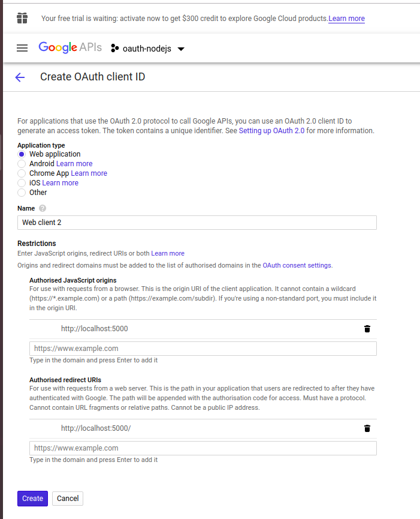

# MERN Stack

[tutorial](https://www.youtube.com/watch?v=e8zrIq9NlUo&list=PLB97yPrFwo5hr5PpM9vkraDdrgnH3oWHm&index=2)

**All packages to use**

 - [express](https://expressjs.com/)
 - [passport-google-oauth20](http://www.passportjs.org/packages/passport-google-oauth20/)
 - [passport](http://www.passportjs.org/)
 - 

 ### Google API

  1. Go to [google developer console](https://console.developers.google.com)
  2. Sign up and create a new project
  3. ENABLE API AND SERVICES
  4. From **API Library** search for **Google+ API** 
  5. ENABLE api
  6. Cofigure Consent Screen -> Set Application name, logo and we can leave rest
  7. Credentials -> Create Creadentials -> OAuth client ID
  8. fill the form

  

  9. For temporarily change or add new authorised redirects urls from client id for web application
  10. URL `http://localhost:5000/auth/google/callback`